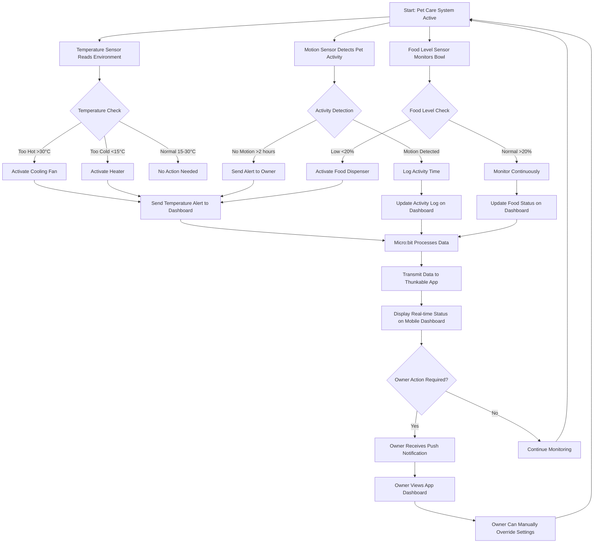

# Smart Pet Care IoT System

## Project Overview

The Smart Pet Care IoT System is an intelligent, automated solution designed to monitor and manage your pet's wellbeing when you're away from home. This comprehensive IoT system integrates multiple sensors, a Micro:bit controller, and a mobile dashboard to provide real-time monitoring of temperature, activity, and food levels. The system automatically responds to environmental changes and sends alerts to pet owners through a mobile application, ensuring your pet remains comfortable, active, and well-fed.

### Key Objectives
- **Automated Pet Care**: Automatically dispense food and regulate temperature without manual intervention
- **Real-Time Monitoring**: Track pet activity, environmental conditions, and food levels in real-time
- **Smart Alerts**: Receive instant notifications when your pet needs attention
- **Remote Control**: Monitor and control your pet's environment from anywhere via mobile app

---

## IoT System Architecture

### 1. Sensors (Input Devices)

#### Temperature Sensor
- **Type**: DHT11/DHT22 Digital Temperature & Humidity Sensor
- **Function**: Continuously monitors ambient temperature
- **Range**: 0°C to 50°C
- **Operating Logic**: Triggers heating/cooling actuators when temperature exceeds safe thresholds
- **Safe Range**: 15°C - 30°C

#### Motion Sensor
- **Type**: PIR (Passive Infrared) Motion Sensor
- **Function**: Detects pet movement and activity
- **Detection Range**: Up to 7 meters
- **Operating Logic**: Logs activity timestamps and triggers alerts if no motion detected for >2 hours
- **Purpose**: Ensures pet is active and healthy

#### Food Level Sensor
- **Type**: Ultrasonic Distance Sensor (HC-SR04)
- **Function**: Measures food quantity in the feeding bowl
- **Measurement**: Distance-based calculation converted to percentage
- **Operating Logic**: Triggers food dispenser when level drops below 20%
- **Update Frequency**: Every 30 minutes

### 2. Controller & Logic (Processing Unit)

#### Micro:bit Microcontroller
- **Role**: Central processing unit for the IoT system
- **Responsibilities**:
  - Collect data from all connected sensors
  - Process sensor readings and apply decision logic
  - Control actuators based on predefined thresholds
  - Transmit data to mobile dashboard via Bluetooth
  - Log historical data for trend analysis

#### Decision Logic
- **Temperature Control**: If temp >30°C → activate fan; if temp <15°C → activate heater
- **Activity Monitoring**: If no motion >2 hours → send alert to owner
- **Food Management**: If food level <20% → activate dispenser and send notification
- **Data Transmission**: Send status updates to app every 5 seconds

### 3. Actuators (Output Devices)

#### Cooling Fan
- **Type**: 5V DC Fan
- **Trigger**: Temperature exceeds 30°C
- **Function**: Cools the environment to maintain optimal temperature

#### Heater Element
- **Type**: Small heating pad or ceramic heater
- **Trigger**: Temperature drops below 15°C
- **Function**: Warms the environment during cold conditions

#### Food Dispenser
- **Type**: Servo motor-controlled dispenser mechanism
- **Trigger**: Food level below 20% or manual override
- **Capacity**: Holds up to 2kg of dry pet food
- **Dispensing**: Controlled portions to prevent overfeeding

### 4. Dashboard (User Interface)

#### Thunkable Mobile Application
- **Platform**: iOS and Android compatible
- **Connectivity**: Bluetooth connection to Micro:bit
- **Features**:
  - Real-time temperature, activity, and food level display
  - Visual gauges and status indicators
  - Push notifications for alerts
  - Manual control buttons for emergency operations
  - Historical data graphs (24-hour trends)
  - Settings panel for customizing thresholds
  - Dark mode support

#### Dashboard Displays
- **Temperature Gauge**: Visual thermometer with color-coded status
- **Activity Log**: Timeline of detected movements
- **Food Level Bar**: Percentage indicator with refill reminder
- **Alert Center**: Notification history and active warnings
- **Control Panel**: Manual override buttons for all actuators

---

## System Flow Diagram

The following Mermaid diagram illustrates the complete flow of the Smart Pet Care IoT system, from sensor data collection to user dashboard display:

---

## Project Files

- **README.md**: This comprehensive documentation file
- **flow_diagram.mmd**: Mermaid flowchart source file for the system architecture
- **microbit_code.hex**: Compiled Micro:bit firmware (Intel HEX format)
- **app_description.txt**: Detailed description of the Thunkable mobile application features

---

## How It Works

1. **Continuous Monitoring**: Sensors continuously collect environmental and activity data
2. **Data Processing**: Micro:bit controller processes sensor inputs and applies decision logic
3. **Automated Response**: Actuators respond automatically to maintain optimal conditions
4. **Real-Time Updates**: System transmits data to mobile app every 5 seconds
5. **Alert System**: Owner receives push notifications for critical events
6. **Manual Override**: Owner can take control through mobile app when needed

---

## Benefits

- ✅ **Peace of Mind**: Monitor your pet's environment 24/7 from anywhere
- ✅ **Automated Care**: System responds to pet needs without manual intervention
- ✅ **Energy Efficient**: Actuators only activate when necessary
- ✅ **Data-Driven Insights**: Historical data helps understand pet behavior patterns
- ✅ **Scalable Design**: Easy to add more sensors or features
- ✅ **Cost-Effective**: Built with affordable, readily available components

---

## Future Enhancements

- Water level monitoring and automatic refilling
- Camera integration for visual monitoring
- AI-powered behavior analysis
- Integration with smart home systems
- Voice control via Alexa/Google Assistant
- Multi-pet support with individual profiles

---

## Repository Information

**Repository**: [Smart-Pet-Care-IoT-project](https://github.com/Ranjith1605/Smart-Pet-Care-IoT-project)

**Created**: 2025

**License**: MIT License

---

## Getting Started

1. Clone this repository
2. Flash the `microbit_code.hex` file to your Micro:bit using the Micro:bit USB connection
3. Connect sensors to the specified Micro:bit pins (refer to circuit diagram)
4. Import the Thunkable project and configure Bluetooth connection
5. Power on the system and pair the mobile app with Micro:bit
6. Monitor your pet's wellbeing from the dashboard!

---

**Made with ❤️ for pet owners who care**
