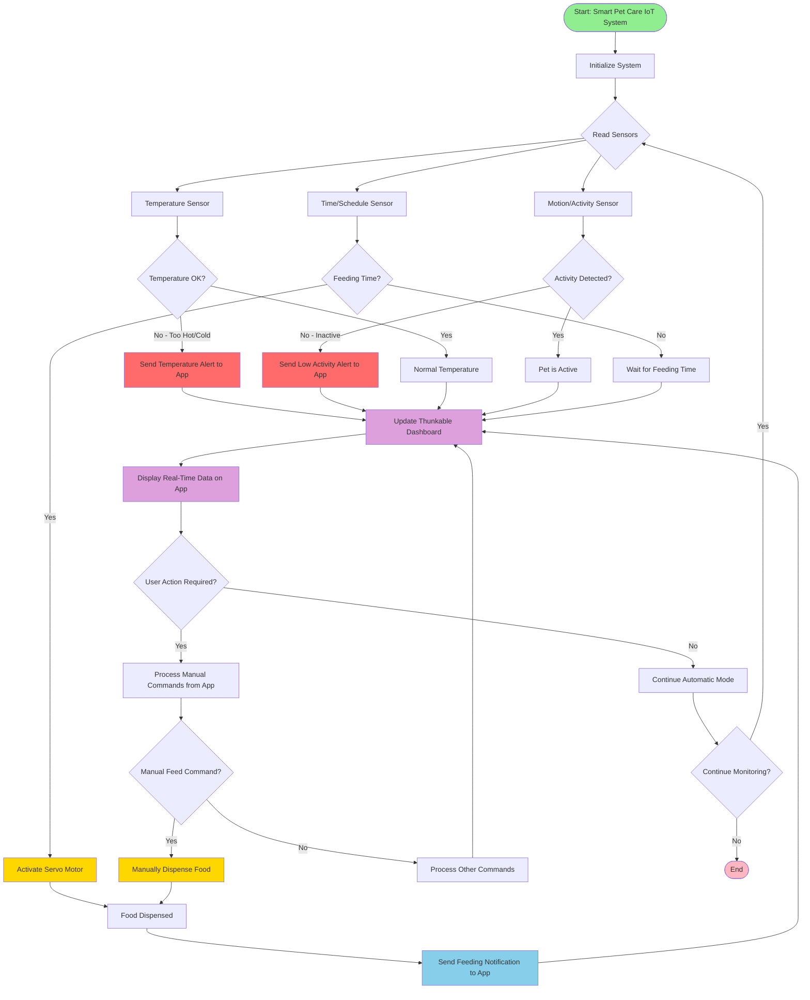

# Smart Pet Care IoT System

A comprehensive Internet of Things (IoT) solution for automated pet care, monitoring, and health management. This capstone project integrates sensors, embedded controllers, and mobile app technology to ensure your pet's wellbeing even when you're away.

## 📋 Table of Contents
- [Problem Statement & Context](#problem-statement--context)
- [IoT System Design](#iot-system-design)
- [System Flow Diagram](#system-flow-diagram)
- [Hardware Components](#hardware-components)
- [Software Components](#software-components)
- [Setup Instructions](#setup-instructions)
- [Usage Guide](#usage-guide)
- [Features](#features)
- [Future Enhancements](#future-enhancements)

---

## 🐾 Problem Statement & Context

### The Challenge
Pet owners often face challenges when they need to be away from home:
- **Feeding schedules:** Ensuring pets are fed on time, especially for pets requiring strict dietary routines
- **Health monitoring:** Tracking environmental conditions that affect pet comfort and safety
- **Activity tracking:** Knowing if pets are active and healthy while owners are away
- **Peace of mind:** Reducing anxiety about pet wellbeing during work hours or travel

### The Solution
The Smart Pet Care IoT System addresses these challenges by:
1. **Automating feeding schedules** with programmable dispensing times
2. **Monitoring environmental conditions** (temperature) to ensure pet comfort
3. **Tracking pet activity** through motion sensors to detect unusual behavior
4. **Providing real-time alerts** to pet owners via mobile app
5. **Enabling remote control** for manual feeding and system management

This system is particularly beneficial for:
- Working professionals who spend long hours away from home
- Pet owners with multiple pets requiring different feeding schedules
- Elderly or mobility-impaired pet owners
- Pets with medical conditions requiring strict feeding routines

---

## 🔧 IoT System Design

The Smart Pet Care IoT System follows a classic IoT architecture with three main layers:

### 1. Sensing Layer (Input)
**Temperature Sensor:**
- Monitors ambient temperature where the pet is located
- Detects if environment is too hot or cold for pet safety
- Triggers alerts when temperature exceeds safe thresholds

**Motion/Activity Sensor:**
- Detects pet movement and activity levels
- Tracks whether pet is active or inactive
- Helps identify unusual behavior patterns (extended inactivity may indicate health issues)

**Time/Schedule Sensor:**
- Real-time clock functionality in Micro:bit
- Tracks current time for automated feeding schedules
- Manages feeding intervals and timing precision

### 2. Processing Layer (Logic)
**Micro:bit Controller:**
- Acts as the central processing unit for the entire system
- Reads sensor data and makes decisions based on programmed logic
- Manages communication with mobile app via Bluetooth
- Controls actuators based on sensor inputs and user commands
- Implements fail-safe mechanisms for reliable operation

**Decision Logic:**
- Temperature analysis: Compares readings against safe ranges
- Activity monitoring: Analyzes motion patterns over time
- Feeding control: Executes scheduled and manual feeding commands
- Alert generation: Determines when to notify pet owners
- Data logging: Records events for historical analysis

### 3. Actuation Layer (Output)
**Servo Motor (Food Dispenser):**
- Mechanically dispenses predetermined portions of food
- Activated automatically at scheduled times
- Can be triggered manually via app command
- Precise control ensures accurate portion sizes

**Bluetooth Module (Communication):**
- Establishes wireless connection between Micro:bit and mobile app
- Transmits sensor data and system status to app
- Receives commands from app for manual control
- Maintains persistent connection with auto-reconnect capability

**Mobile App Dashboard (User Interface):**
- **Thunkable-based application** providing intuitive interface
- **Real-time monitoring:** Displays temperature, activity, and feeding status
- **Alert system:** Push notifications for critical events
- **Manual controls:** Override automatic functions when needed
- **Configuration:** Set schedules, thresholds, and preferences
- **History/Logs:** View past events and system activity

### System Architecture Flow
```
[Sensors] → [Micro:bit Controller] → [Decision Logic] → [Actuators]
                     ↕
             [Bluetooth Module]
                     ↕
          [Thunkable Mobile App]
                     ↕
               [Pet Owner]
```

---

## 📊 System Flow Diagram

The following diagram illustrates the complete operational flow of the Smart Pet Care IoT System:



---

## 🛠️ Hardware Components

### Required Components
1. **BBC Micro:bit (v2 or later)**
   - Main controller board with built-in sensors
   - Bluetooth Low Energy support
   - 5x5 LED matrix for status display
   - Two programmable buttons

2. **Temperature Sensor**
   - DHT11 or DHT22 temperature/humidity sensor
   - Operating range: -40°C to 80°C
   - Connects to Micro:bit GPIO pins

3. **Motion/PIR Sensor**
   - Passive Infrared (PIR) sensor for motion detection
   - Detection range: 3-7 meters
   - Adjustable sensitivity

4. **Servo Motor**
   - SG90 or similar 180° servo motor
   - Used to actuate food dispensing mechanism
   - Powered by external power supply (4.8V-6V)

5. **Power Supply**
   - USB power for Micro:bit (5V)
   - Battery pack or wall adapter for servo motor
   - Ensure adequate current capacity (at least 1A)

6. **Structural Components**
   - Food container and dispenser mechanism
   - Mounting bracket for servo motor
   - Enclosure for electronics (weather-resistant if outdoor use)

### Wiring Connections
```
Temperature Sensor:
  - VCC → 3.3V (Micro:bit)
  - GND → GND
  - Data → Pin 0

Motion Sensor:
  - VCC → 3.3V
  - GND → GND
  - Out → Pin 1

Servo Motor:
  - VCC → External Power Supply (+)
  - GND → Common Ground
  - Signal → Pin 2
```

---

## 💻 Software Components

### 1. Micro:bit Firmware (microbit_code.hex)
- **Development Platform:** Microsoft MakeCode
- **Programming Language:** Block-based coding (converts to JavaScript/TypeScript)
- **Key Functions:**
  - Sensor data reading and processing
  - Servo motor control algorithms
  - Bluetooth communication protocols
  - Real-time clock and scheduling
  - Alert triggering logic

**To upload:**
1. Connect Micro:bit to computer via USB
2. Micro:bit appears as USB drive
3. Drag and drop `microbit_code.hex` to the drive
4. LED will flash during upload
5. Micro:bit will reset and run new code

### 2. Mobile Application (Thunkable)
- **Platform:** Thunkable (cross-platform: iOS & Android)
- **Interface:** Drag-and-drop visual development
- **Key Screens:**
  - Dashboard (monitoring)
  - Control Panel (manual operations)
  - Settings (configuration)
  - Alert History (notifications log)

**Features implemented:**
- Bluetooth BLE integration
- Real-time data visualization
- Push notifications
- Local data storage
- User preferences management

Detailed app structure is available in `app_description.txt`

### 3. Communication Protocol
- **Technology:** Bluetooth Low Energy (BLE)
- **Data Format:** Structured messages with checksums
- **Update Frequency:** 
  - Temperature: Every 30 seconds
  - Motion: Event-triggered
  - Feeding: Event-triggered
- **Commands:**
  - `FEED_NOW`: Manual feeding
  - `SET_SCHEDULE`: Update feeding times
  - `GET_STATUS`: Request current status
  - `SET_TEMP_THRESHOLD`: Update temperature limits

---

## 📝 Setup Instructions

### Step 1: Hardware Assembly
1. **Mount the Micro:bit** in the electronics enclosure
2. **Connect sensors** according to wiring diagram above
3. **Attach servo motor** to food dispenser mechanism
4. **Connect power supplies** (USB for Micro:bit, battery for servo)
5. **Test connections** - verify LEDs light up when powered

### Step 2: Upload Micro:bit Code
1. Download `microbit_code.hex` from this repository
2. Connect Micro:bit to computer using USB cable
3. Micro:bit appears as a USB drive named "MICROBIT"
4. Drag and drop the `.hex` file onto the MICROBIT drive
5. Yellow LED will flash during upload
6. Once complete, Micro:bit will reset and display a smiley face

### Step 3: Install Mobile App
**Option A: Use pre-built APK (Android)**
1. Contact project maintainer for APK file
2. Enable "Install from Unknown Sources" in Android settings
3. Install APK on your device

**Option B: Build from Thunkable (iOS/Android)**
1. Create account at [thunkable.com](https://thunkable.com)
2. Import project using app description in `app_description.txt`
3. Recreate UI components and logic blocks
4. Test in Thunkable Live app
5. Build and download for your platform

### Step 4: Pair Devices
1. Launch mobile app
2. Enable Bluetooth on your phone
3. Power on Micro:bit (should be within 10 meters)
4. In app, tap "Connect Device"
5. Select "Smart Pet Care" from available devices
6. Wait for "Connected" status confirmation

### Step 5: Configuration
1. **Set feeding schedule:**
   - Open Settings → Feeding Schedule
   - Add feeding times (e.g., 8:00 AM, 6:00 PM)
   - Set portion sizes
   - Enable automatic mode

2. **Configure temperature alerts:**
   - Open Settings → Temperature Alerts
   - Set minimum temperature (e.g., 15°C)
   - Set maximum temperature (e.g., 30°C)
   - Enable notifications

3. **Test system:**
   - Press "Manual Feed" button
   - Verify servo motor activates and dispenses food
   - Check temperature reading on dashboard
   - Walk near motion sensor and verify activity detection

### Step 6: Physical Installation
1. Place food container in accessible location for refilling
2. Position motion sensor to cover pet's activity area
3. Ensure temperature sensor is in representative location
4. Secure all components to prevent pet tampering
5. Route cables safely to avoid tripping hazards

---

## 📱 Usage Guide

### Daily Operation

**Morning Routine:**
1. Check app dashboard for overnight activity
2. Review any alerts or notifications
3. Verify food dispenser has adequate food supply
4. Confirm scheduled feedings are enabled

**During the Day:**
- Monitor real-time temperature and activity
- Receive push notifications for important events
- Use manual feed button if needed for extra treats
- Check feeding confirmation notifications

**Evening Routine:**
1. Review daily activity summary
2. Refill food dispenser if needed
3. Adjust next day's schedule if necessary
4. Check battery levels (if using battery power)

### Manual Feeding
1. Open mobile app
2. Navigate to Control Panel
3. Tap "Feed Now" button
4. Confirm action in dialog
5. Wait for confirmation notification
6. Verify food dispensed successfully

### Responding to Alerts
**Temperature Alert:**
- If too hot: Move pet to cooler area, check air conditioning
- If too cold: Provide blanket, check heating system
- Adjust thresholds if false alarms occur

**Low Activity Alert:**
- Check camera (if available) or return home to check on pet
- May indicate pet is sleeping, ill, or system error
- Verify sensor positioning and sensitivity

**Feeding Failed Alert:**
- Check if food dispenser is empty
- Verify servo motor is connected and powered
- Check for mechanical jam in dispenser

### Maintenance
- **Daily:** Visual inspection of food level
- **Weekly:** Clean dispenser mechanism, check connections
- **Monthly:** Test all sensors and actuators, update schedules
- **As needed:** Refill food, replace batteries, clean sensors

---

## ✨ Features

### Current Features
✅ **Automated Feeding**
- Schedule up to 4 feeding times per day
- Adjustable portion sizes
- Manual override capability

✅ **Environmental Monitoring**
- Real-time temperature tracking
- Customizable alert thresholds
- Historical data logging

✅ **Activity Tracking**
- Motion detection and logging
- Activity pattern analysis
- Inactivity alerts

✅ **Mobile Dashboard**
- Real-time status display
- Push notifications
- Remote control capability
- Alert history

✅ **Reliability Features**
- Automatic reconnection after disconnection
- Fail-safe feeding mechanism
- Battery level monitoring
- Error logging and reporting

### System Benefits
- **Convenience:** Never miss a feeding time
- **Peace of Mind:** Monitor pet remotely
- **Health Tracking:** Detect unusual behavior early
- **Flexibility:** Adjust schedules on-the-fly
- **Cost-Effective:** Uses affordable, accessible components
- **Expandable:** Easy to add more sensors or features

---

## 🚀 Future Enhancements

### Planned Features
- [ ] **Camera Integration**
  - Live video streaming
  - Motion-triggered photo capture
  - Two-way audio communication

- [ ] **Multi-Pet Support**
  - Individual feeding schedules
  - Per-pet activity tracking
  - Separate food dispensers

- [ ] **Advanced Analytics**
  - AI-powered behavior analysis
  - Health trend predictions
  - Feeding pattern optimization

- [ ] **Smart Home Integration**
  - Amazon Alexa voice control
  - Google Home compatibility
  - IFTTT automation triggers

- [ ] **Cloud Connectivity**
  - Remote access from anywhere
  - Data backup and sync
  - Family account sharing

- [ ] **Water Dispenser**
  - Automated water level monitoring
  - Refill alerts
  - Water quality tracking

- [ ] **Weight Monitoring**
  - Load cell integration
  - Track pet weight trends
  - Diet recommendations

### Community Contributions
We welcome contributions! Please feel free to:
- Report bugs or issues
- Suggest new features
- Submit pull requests
- Share your customizations
- Improve documentation

---

## 📄 License

This project is licensed under the MIT License - see the [LICENSE](LICENSE) file for details.

---

## 👥 Contributors

- **Project Creator:** IoT Capstone Team
- **Hardware Design:** Electronics Team
- **Software Development:** Mobile App Team
- **Documentation:** Technical Writing Team

---

## 📞 Support

For questions, issues, or suggestions:
- Open an issue on GitHub
- Contact: [Your contact information]
- Documentation: Check `app_description.txt` for app details
- Flow Diagram: See `flow_diagram.mmd` for system architecture

---

## 🙏 Acknowledgments

- BBC Micro:bit Educational Foundation for the excellent development platform
- Thunkable for accessible mobile app development
- Open-source community for libraries and resources
- Pet owners who provided feedback during development

---

**Made with ❤️ for pets and their owners**
